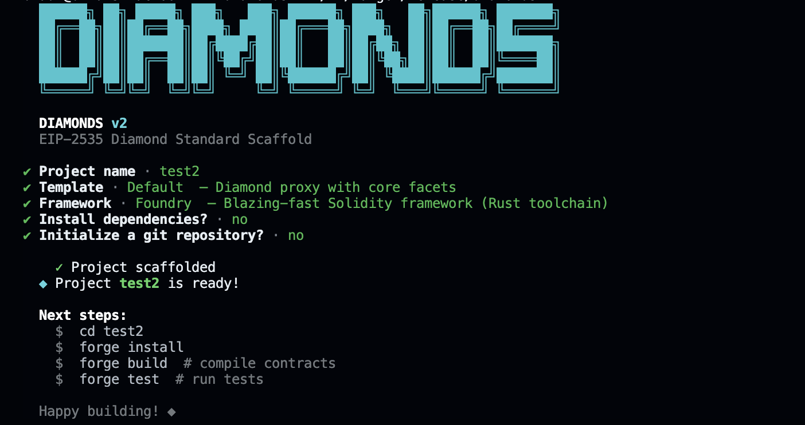

# diamondscaffold

**diamondscaffold** is a CLI tool that helps developers scaffold an EIP-2535 diamond structure with ease. Users can choose between Hardhat or Foundry as their development environment, and they can select between templates like "ERC20", "ERC721", or a default Diamond template to kickstart their smart contract development.



## Features

- Scaffold **EIP-2535 Diamond** architecture.
- Choose between **Hardhat** or **Foundry** frameworks.
- Select from multiple templates: **ERC20**, **ERC721**, and a **default** Diamond template.
- Option to scaffold in **JavaScript** or **TypeScript** when using Hardhat.
- Install project dependencies automatically when using Hardhat.

## Installation

You can install the package globally via npm to use it as a CLI tool.

```bash
npm install -g diamondscaffold
```

## Usage

Once installed, use the `diamonds init` command to scaffold an EIP-2535 Diamond structure.

### Basic Command

```bash
diamonds init
```

This command will prompt you with several questions to help set up your project. Here's the sequence of questions asked:

1. **Project Name**: The name of your project (default is `my-app`).
2. **Template**: Choose a template to scaffold: `Default`, `ERC20`, or `ERC721`.
3. **Framework**: Choose between `Foundry` or `Hardhat`.
4. **Language** (only for Hardhat): Choose between `JavaScript` or `TypeScript`.
5. **Install Dependencies** (only for Hardhat): Option to install dependencies automatically, provided you have an active internet connection.

### Example

```bash
diamonds init
```

During the initialization, you will be prompted with questions like:

```
📝 What is the name of your project? (default: my-app)
📑  What Template would you like to scaffold? (choices: Default, ERC20, ERC721)
🔧 Which framework would you like to use? (choices: Foundry, Hardhat)
📚 Which language do you want to use? (choices: JavaScript, TypeScript)
Do you want to install project dependencies? (only for Hardhat)
```

To scaffold a diamond project using **Hardhat**, **ERC20**, and **TypeScript** with automatic dependency installation:

```bash
diamonds init
```

### Available Templates

1. **ERC20**: A diamond contract implementing the ERC20 token standard.
2. **ERC721**: A diamond contract implementing the ERC721 NFT standard.
3. **Default**: A basic diamond structure with no additional functionality, providing a clean slate to start with.

## Commands

### Version Commands

```bash
# Check current version
diamonds --version
diamonds -v

# Update to latest version
diamonds update
```


### Hardhat Commands

If you scaffold with Hardhat, these commands will be available:

- Compile the project:

  ```bash
  npx hardhat compile
  ```

- Run tests:

  ```bash
  npx hardhat test
  ```

- Deploy the contract:
  ```bash
  npx hardhat run scripts/deploy.js
  ```

### Foundry Commands

If you scaffold with Foundry, these commands will be available:

- Compile the project:

  ```bash
  forge build
  ```

- Run tests:

  ```bash
  forge test
  ```

- Deploy the contract:
  ```bash
  forge script <script-file> --broadcast
  ```

## Contribution

Contributions to **diamondscaffold** are welcome! If you'd like to contribute checkout:

1. [Contribution guildlines](https://github.com/collinsadi/diamonds/blob/main/CONTRIBUTION_GUIDELINES.md)  
2. [Git guildlines](https://github.com/collinsadi/diamonds/blob/main/GIT_GUIDELINES.md)  
3. [Issues guildlines](https://github.com/collinsadi/diamonds/blob/main/ISSUES_GUIDELINES.md)  

## License

This package is licensed under the MIT License. See the [LICENSE](./LICENSE) file for more information.
