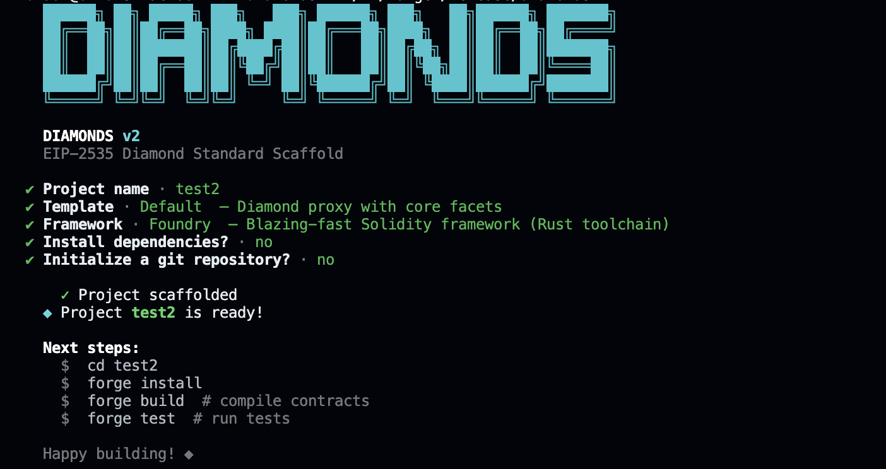

# diamondscaffold

A fast CLI for scaffolding and converting [EIP-2535 Diamond Standard](https://eips.ethereum.org/EIPS/eip-2535) smart contract projects.

Built in Rust. Distributed via npm, crates.io, and standalone binaries.



## Features

- **Scaffold** a full Diamond project in seconds — contracts, tests, deploy scripts, and config
- **Convert** an existing Solidity contract into a Diamond Standard project automatically
- **Foundry** and **Hardhat** support (JavaScript and TypeScript)
- **Three templates**: Default, ERC20, and ERC721
- Optional `git init` and dependency installation
- Single binary — no runtime dependencies

## Installation

### npm (recommended)

```bash
npm install -g diamondscaffold
```

### Cargo (from source)

```bash
cargo install diamondscaffold
```

### GitHub Releases

Download prebuilt binaries for macOS, Linux, and Windows from [Releases](https://github.com/collinsadi/diamonds/releases).

## Quick Start

### Scaffold a new Diamond project

```bash
diamonds init
```

You'll be guided through an interactive prompt:

1. **Project name** — defaults to `diamond-project`
2. **Template** — Default, ERC20, or ERC721
3. **Framework** — Foundry or Hardhat
4. **Language** (Hardhat only) — JavaScript or TypeScript
5. **Install dependencies** — optional
6. **Initialize git** — optional

You can also pass a project name directly:

```bash
diamonds init my-token
```

### Convert an existing contract to Diamond Standard

```bash
diamonds convert MyContract.sol
```

This parses your Solidity file and generates a complete Diamond project:

- `LibAppStorage.sol` — storage library extracted from state variables
- `{Name}Facet.sol` — your contract logic rewritten as a facet
- `I{Name}Facet.sol` — interface for the facet
- `DiamondInit.sol` — initializer derived from your constructor
- Deployment test with selector generation
- Full project config (foundry.toml, .gitmodules, etc.)

Options:

```bash
diamonds convert MyContract.sol --output my-diamond  # custom output dir
diamonds convert MyContract.sol --framework hardhat   # use Hardhat instead of Foundry
```

## Templates

| Template | Description |
|----------|-------------|
| **Default** | Clean Diamond structure — DiamondCut, DiamondLoupe, Ownership facets |
| **ERC20** | Diamond with a full ERC20 token facet, interfaces, and tests |
| **ERC721** | Diamond with a full ERC721 NFT facet, interfaces, and tests |

## Post-Scaffold Commands

### Foundry

```bash
forge build       # compile
forge test        # run tests
```

### Hardhat

```bash
npx hardhat compile                  # compile
npx hardhat test                     # run tests
npx hardhat run scripts/deploy.js    # deploy (JS)
npx hardhat run scripts/deploy.ts    # deploy (TS)
```

## Project Structure

```
diamonds/
├── v1/                  # Legacy Node.js CLI (archived)
├── v2/                  # Rust CLI source
│   ├── src/             # CLI modules (main, banner, prompt, scaffold, convert)
│   ├── templates/       # Embedded project templates
│   └── Cargo.toml
├── npm/                 # npm distribution packages
├── scripts/             # Release and build automation
└── .github/workflows/   # CI/CD
```

## Contributing

Contributions are welcome. Please read [CONTRIBUTING.md](./CONTRIBUTING.md) before opening a PR.

If you're using an AI coding assistant, also review [AI_POLICY.md](./AI_POLICY.md) for guidelines on AI-assisted contributions.

## License

MIT — see [LICENSE.md](./LICENSE.md).
